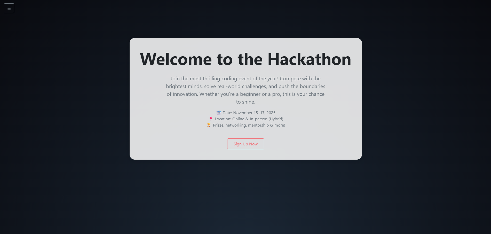
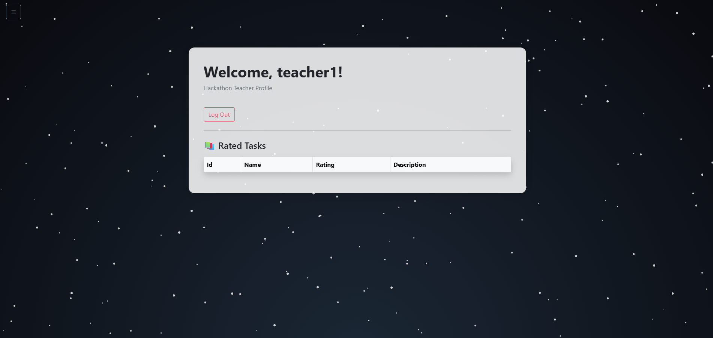
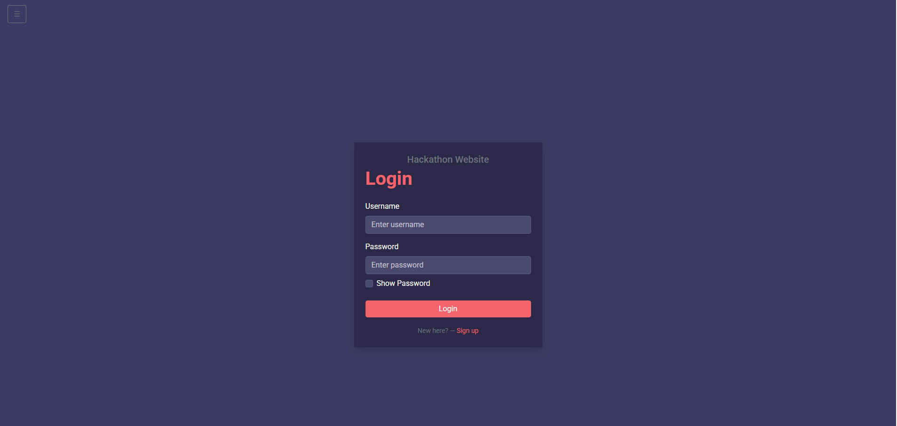
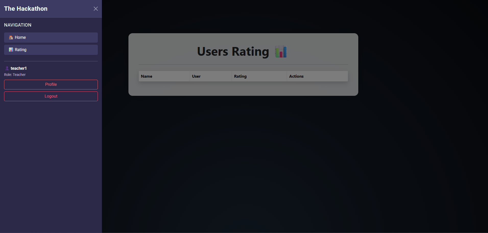

# 🧠 Hackathon Management System

An ASP.NET MVC commercial project.
The decision to make a MVC project was made because of the needed simplicity of the project.

Built with a **three-layer architecture** (DAL → BLL → Web).
It includes task rating, user profiles, and role-specific interaction patterns.

---

## 🛠 Tech Stack

### Architecture

- **DAL (Data Access Layer)**  
  Built with Entity Framework Core using **SQLite** for lightweight and portable storage.  
  Designed to minimize setup complexity.  
  - **Db Entities**:
    - `HackathonTask`
    - `User`

- **BLL (Business Logic Layer)**  
  Encapsulates core logic, validation, and DTO mappings.

- **Web (Presentation Layer)**  
  ASP.NET Core MVC application providing RESTful endpoints and dynamic Razor views.

---

### Features & Libraries

- 🔐 **JWT Authentication**
  - Access-token based
  - Made a decision not to make refresh rokens

- 🔄 **AutoMapper**  
  - Smooth mapping between entities and DTOs  
  - Reduces boilerplate code

- ✅ **FluentValidation**  
  - Used for model validation  
  - _"And also, I just like how it works"_

---

## 🎨 Styling & UI

The UI design:

- **Profile and task pages**  
  - White central containers  
  - Rounded corners and subtle shadows  
  - Dark radial gradient background

- **Home page animation**  
  - Smooth text fade-in introducing the hackathon  
  - Snowflake animation replaced with modern subtle theming

All styles are split into:
- `profileStyle.css`
- `homeStyle.css`
- `Snow.css`(additional style file)
  
---

## 📸 Screenshots

### Home Page

### User Profile (Teacher)

### Login Page

### Rating Page with Sidebar

